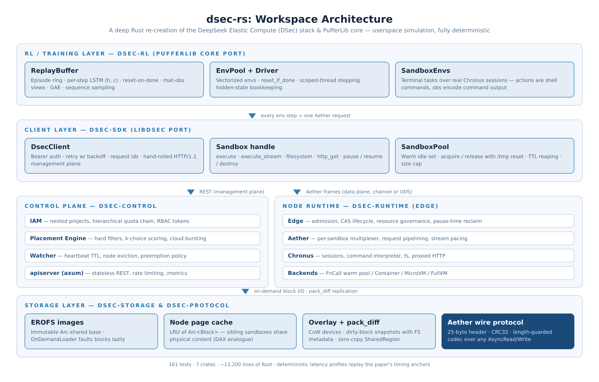

# dsec-rs

**A deep Rust reimplementation of [DeepSeek Elastic Compute (DSec)](docs/paper-mapping.md) —
the sandbox infrastructure for agentic RL training at scale — together with a
Rust port of PufferLib's core and a port of the [MiMo Live RL agentic
environments](docs/mimo-liverl.md) (HuggingFace `XiaomiMiMo/MiMo-V2.6-RL-oss`).**

Built from the paper *"DeepSeek Elastic Compute (DSec): A Sandbox Infrastructure
for Effective Agentic Training at Scale"* (DeepSeek-AI + Tsinghua, 2026) and
the XiaomiMiMo Live RL environment stack: every component is re-created in
Rust as a deterministic userspace simulation that builds and runs anywhere —
no root, no containers, no Firecracker, fully reproducible (seeded latency +
PRNG).

[](https://github.com/idrees2516/dsec-rs/actions/workflows/ci.yml)
[](https://crates.io/crates/dsec-runtime)
[](LICENSE)
[](Cargo.toml)
[](#running-the-tests)
[](crates)

---

## Why

DSec runs **100k+ concurrent sandboxes** and **~5,000 sandbox creations per
second** to train agents that interact with real tooling. The paper's stack is
mixed-language: 3FS (C++), EROFS (kernel C), Firecracker (Rust), the
ublk/OverlayBD user-space block layer (Rust, open-sourced at
[kvcache-ai/AgentENV](https://github.com/kvcache-ai/AgentENV)) — and Python
for everything user-facing (libdsec SDK, control plane glue, PufferLib RL
integration).

**This workspace re-implements the Python-side architecture in Rust** — the
same role PufferLib plays for the training loop — while faithfully modeling
the storage, isolation, and scheduling layers in userspace. The result is a
single-language, dependency-light, fully deterministic test bed for the
paper's ideas, suitable for research, teaching, and as a reference for
production ports.

## Architecture



Two planes, exactly as in the paper: a **management plane** (stateless REST
apiserver, IAM, placement, watcher) and a **data plane** (Aether frame
multiplexing over UDS/vsock-style transports into per-node Edge runtimes).

| crate            | role                                                                                                        | paper component                                        |
|------------------|-------------------------------------------------------------------------------------------------------------|--------------------------------------------------------|
| [`dsec-protocol`](crates/dsec-protocol) | Aether wire protocol: frames, CRC32, request/response codec, multiplexing channels                           | Aether data plane                                      |
| [`dsec-storage`](crates/dsec-storage)   | EROFS-style images, on-demand block loading, node LRU page cache, overlay CoW devices, `pack_diff` snapshots, async prefetch pipeline, zero-copy shared regions | storage layer (EROFS / 3FS / OverlayBD / ublk)         |
| [`dsec-runtime`](crates/dsec-runtime)   | Edge lifecycle state machine, Aether server/client (channel + UDS transports), Chronus sessions (exec / fs / http / streaming), four backends (FnCall pool, Container, MicroVM, FullVM), resource governance with pause-time reclaim | Edge, Aether, Chronus, sandbox backends                |
| [`dsec-control`](crates/dsec-control)   | IAM with nested project quotas, versioned registry + event log, k-choice placement engine with cloud bursting, heartbeat watcher with eviction + preemption, REST apiserver (axum), Prometheus metrics, rate limiting | apiserver, IAM, Placement Engine, Watcher              |
| [`dsec-sdk`](crates/dsec-sdk)           | **libdsec port**: `DsecClient`, `Sandbox` (execute/filesystem/http/streams/pause/resume), `SandboxPool`, retry with backoff, channel+UDS transports, full-stack `LocalCluster` assembly | libdsec                                                |
| [`dsec-rl`](crates/dsec-rl)             | **PufferLib core port**: episode ring replay buffer with LSTM hidden-state reset, vectorized env pools (parallel stepping, pipelined batch pool), mat-obs/flat-obs, GAE, LSTM cell, training driver, agent sandboxes as RL envs | RL co-design layer                                     |
| [`dsec-agentenv`](crates/dsec-agentenv) | **MiMo Live RL environments port**: the HuggingFace dataset schema (verl rows + `instance_json`, real parquet loading), two-container pod topology with MCP sidecars, rubric verifiers with the REWARD_TESTBED_CORRUPTED masking contract, multi-turn agent rollouts, fully-async GRPO + GAR + GRS Live RL training with adversarial screening, the Scale AgentEnv REST server, Repo2RL conversion, and a generic real-world environment factory | [MiMo Live RL](docs/mimo-liverl.md), Scale AgentEnv, Repo2RLEnv |
| [`dsec-karotte`](crates/dsec-karotte) | **Karotte robust RL environments port** (preferencemodel/karotte): the `Contract` confinement tri-state with the gVisor fail-open distrust, cgroup v1/v2 student groups (`memory.max` + `swap.max=0`, `oom.group`, `cgroup.kill`), the RSS/PSS/tmpfs/SysV watchdog weigher, the fd-safe reclaim sweep, defensive submission custody (symlink/FIFO/cap refusals), regex/rubric/executable judges with `And`/`Or` short-circuit composites, the message loop with turn/time/context limits, the MCP JSON-RPC tool server, the bash/file tools with the hand-rolled unified diff, the 14-event transcript with exact wire JSON, and the Firecracker VM plan | [Karotte](docs/karotte.md)                                                |
| [`dsec-autoenv`](crates/dsec-autoenv) | **AutoEnvScaling data flywheel** (Yu et al. 2026): environment design as a terminal task — the proposer sandbox with the Figure-18 workspace (editable/fixed regions, web gating, egress rules), the complete Harbor task model (multi-step `steps/`, three-layer network policy, shared/separate verifiers, pitfalls-as-lints), host admission (build + reference-1.0 + no-op<0.5 + 13-gram decontamination + `harbor check` rubric), solver-guided calibration (4→8 rollouts, [0.25, 0.75] band, std ≥ 0.1, hinted diagnostics, ≤ 2 revisions), Eq. 1/2/3 rewards with DAPO filtering and DPPO under a TV-0.1 trust region, carry-over of unfinished trajectories, pool review every 16 updates, Continual-Harness evolution, Cold-Start selection with paired sign tests, HiL clarification tasks with Ask-F1, and cross-domain admission across seven domains | [AutoEnvScaling](docs/autoenvscaling.md) |
| [`dsec-firecracker`](crates/dsec-firecracker) | **Real Firecracker microVM backend** behind the `MicrovmDriver` trait: VMM process launch + API socket, machine config from the sandbox spec, shared read-only rootfs + scratch drives, real pause/resume, diff snapshots (pack_diff analogue), snapshot restore, graceful destroy; fake-VMM test harness over real UDS | MicroVM backend (Firecracker)                          |
| [`dsec-bench`](crates/dsec-bench)       | Benchmark suite: creation rate vs the paper's ~5k/s, 100k burst, pause/resume latency, RL steps/sec vs PufferLib, pack_diff savings, placement throughput/quality, HTTP RPS, codec throughput | —                                                      |
| [`dsec-profiling`](crates/dsec-profiling) | Sampling-profiler harness for the sandbox-env stepping path: SIGPROF sampling (unprivileged), flamegraph SVG, leaf-symbol profile, Aether data-plane wall-time share (internal tool, `publish = false`) | —                                                      |

## Quick start

```bash
git clone https://github.com/idrees2516/dsec-rs.git
cd dsec-rs
cargo build --release          # ~2 min on 2 cores
cargo test --workspace --all-features   # 620 tests: unit + integration + doc
```

A practical adoption guide — who uses which layer, and how to wire the
crates into a training loop, an eval harness, or a platform — lives in
[**`docs/usage.md`**](docs/usage.md).

Run the examples (each exercises a full stack slice):

```bash
cargo run --release -p dsec-sdk --example control_plane_demo   # IAM -> quota -> REST -> exec -> cross-node packdiff -> pause -> stream -> pool
cargo run --release -p dsec-rl --example training_loop         # sandbox envs + replay buffer + LSTM reset (0 violations)
cargo run -p dsec-agentenv --example envgen_zoo                  # Live RL env factory: compile + boot + rollout + grade every domain template
cargo run -p dsec-agentenv --features server --example live_pipeline   # the AgentEnv REST server, driven end-to-end over HTTP
cargo run -p dsec-agentenv --features parquet --example real_dataset . # load the REAL HuggingFace MiMo-V2.6-RL-oss parquet shards
cargo run -p dsec-karotte --example full_run            # the Karotte pipeline: confinement → cgroups → firewall → MCP → judges → transcript
cargo run -p dsec-autoenv --example flywheel             # the AutoEnvScaling data flywheel: propose → validate → calibrate → train → review, 6 rounds
cargo run --release -p dsec-sdk --example burst_simulation     # 100k sandbox lifecycles
```

### Running the tests

The suite covers protocol round-trips, storage invariants (CoW isolation,
pack_diff fidelity, cache dedup), lifecycle state machines, admission
concurrency, IAM quota rollup, placement quality, e2e SDK flows over real
UDS transports, and RL invariants (episode contiguity, LSTM reset-on-done,
GAE correctness vs a naive reference):

```bash
cargo test --workspace --all-features           # everything (620)
cargo test -p dsec-agentenv --features server,parquet  # the REST/parquet-gated suites (77)
cargo test -p dsec-karotte                             # the Karotte pipeline (184)
cargo test -p dsec-autoenv                             # the AutoEnvScaling flywheel (167)
cargo test -p dsec-storage packdiff          # one area
cargo nextest run                            # if you prefer nextest
```

### Benchmarks

```bash
cargo run --release -p dsec-bench            # full suite, writes bench-results.{json,md}
cargo run --release -p dsec-bench -- --quick # smoke-sized
cargo run --release -p dsec-bench -- creation --count 5000 --concurrency 256 --paper-latency
cargo run --release -p dsec-bench -- burst --count 100000
```

## Results vs the paper

2-core CI-class VM, release profile, **interleaved A/B against the `v0.1.0`
baseline** (per-optimization deep-dive: [`docs/performance.md`](docs/performance.md);
raw logs: [`docs/benchmarks.md`](docs/benchmarks.md)):

| metric | dsec-rs | paper / reference |
|---|---|---|
| creation rate (paper latency model, 256 concurrent) | **6,306 /s** | ~5,000/s cluster-wide |
| creation rate (software path, A/B: +35-123%) | **13,400 /s** | — |
| burst lifecycle (create + exec + destroy, A/B: +22%) | **56.7k /s, 0 errors @ 100k** | 100k+ concurrent sandboxes |
| pause latency (p50) | 4,634 ms (injected model, paper-anchored) | ~4 s (kernel checkpoint + reclaim) |
| resume latency (p50) | 1,738 ms | ~1.5 s class |
| apiserver throughput (keep-alive, pipelined) | **129,000 RPS** (6.1x vs cold) | must sustain ~5k creates/s |
| RL vectorized envs (A/B: 2.4x) | **1.42M steps/s** | PufferLib ~1M+/s (Cython) |
| GAE (A/B: 5.2x) | **117M transitions/s** | C-path in pufferlib train() |
| replay buffer enqueue | 6.3M transitions/s | PufferReplayBuffer ~10M+/s |
| sandbox-env RL, pipelined (A/B: 2.5x vs 0.1 base) | **~35k steps/s** | — |
| sandbox-env RL, per-env reference (A/B: 1.45x) | 28.8k steps/s | — |
| pack_diff snapshot (A/B: 183x) | **8.9M packs/s** | replicate working state w/o full copy |
| pack_diff apply (A/B: 4.1x) | **34.9k applies/s** | — |
| pack_diff size ratio | **0.05x** full image | replicate working state w/o full copy |
| placement decisions | 128k /s @ 1,024 nodes; k-choice quality 67.65% (unchanged) | must not bottleneck ~5k creates/s |
| protocol codec (A/B: 2.1-2.9x) | 888 / 892 MB/s enc/dec | — |

## libdsec API mapping

| libdsec (paper, Python)                  | dsec-sdk (Rust)                               |
|------------------------------------------|-----------------------------------------------|
| `dsec.DsecClient(token, endpoint)`       | `DsecClient::new(token, endpoint, transport)` |
| `client.sandboxes.create(spec)`          | `client.create_sandbox(spec).await`           |
| `sandbox.execute(cmd)`                   | `sandbox.execute(cmd).await`                  |
| `sandbox.execute_stream(cmd)`            | `sandbox.execute_stream(cmd).await`           |
| `sandbox.filesystem.read_file(p)`        | `sandbox.read_file(p).await`                  |
| `sandbox.filesystem.write_file(p, data)` | `sandbox.write_file(p, data).await`           |
| `sandbox.http.get(url)`                  | `sandbox.http_get(url).await`                 |
| `sandbox.pause()` / `resume()`           | `sandbox.pause()` / `resume().await`          |
| `sandbox.pool(min, max)`                 | `SandboxPool::new(client, cfg)`               |

REST surface (wire-compatible with the paper's description):

```
POST   /v1/projects            GET /v1/projects/{name}
POST   /v1/tokens
POST   /v1/sandboxes           GET /v1/sandboxes[?project=]
GET    /v1/sandboxes/{id}      DELETE /v1/sandboxes/{id}
POST   /v1/sandboxes/{id}/pause   POST /v1/sandboxes/{id}/resume
GET    /v1/nodes               POST /v1/nodes/{id}/heartbeat
GET    /v1/cluster             GET /healthz   GET /metrics
```

## Design notes

- **Two planes**, as in the paper: management (REST) and data (Aether
  frames). The data plane is transport-agnostic: in-process channels for
  deterministic simulation, real Unix domain sockets for production-shaped
  runs.
- **Deterministic simulation**: splitmix64 PRNG + injectable latency models
  (`NodeLatencyProfile::paper()` replays the paper's timing anchors — ~5 ms
  FnCall handout, ~900 ms microVM, ~4 s pause; `::zero()` for pure logic).
- **Lock-free admission**: node resource pools use optimistic
  reserve-verify-rollback on atomics — under full contention exactly
  `max_sandboxes` admissions succeed (regression-tested).
- **Faithful PufferLib semantics**: step-major episode ring, contiguous
  episodes, LSTM (h, c) stored per step and zeroed at episode boundaries,
  mat-obs views, GAE across the ring, `reset_if_done` vectorized stepping.
- **pack_diff**: dirty-block snapshots carry the layered-FS file table and
  allocator cursor, so replicas observe identical filesystems (mirrors the
  real system where FS metadata lives in the replicated blocks).

## Relation to the real DeepSeek stack

The paper's production stack is mixed-language: 3FS (C++), EROFS (kernel C),
Firecracker (Rust), the ublk/OverlayBD user-space block layer (Rust, open
sourced by DeepSeek at [kvcache-ai/AgentENV](https://github.com/kvcache-ai/AgentENV)),
and the Python layers (libdsec, RL integration, PufferLib). This workspace
re-implements the Python-side architecture in Rust — the same role PufferLib
plays for the training loop — while modeling the storage, isolation and
scheduling layers in userspace. See the
[research report](docs/DSec_Rust_Reimplementation_Report.pdf) for the full
language mapping and the integration points a real deployment would use.

## Repository layout

```
crates/
  dsec-protocol/  dsec-storage/  dsec-runtime/  dsec-control/
  dsec-sdk/       dsec-rl/       dsec-agentenv/  dsec-karotte/  dsec-autoenv/
  dsec-firecracker/  dsec-profiling/  dsec-bench/
docs/
  usage.md                   practical adoption guide (who + how)
  architecture.md            component deep-dive
  paper-mapping.md           paper claim -> code artifact map
  mimo-liverl.md             MiMo Live RL -> dsec-agentenv artifact map
  karotte.md                 Karotte -> dsec-karotte artifact map
  autoenvscaling.md          AutoEnvScaling paper -> dsec-autoenv artifact map
  performance.md             the v0.2.0 optimization campaign (A/B evidence)
  benchmarks.md              full benchmark logs
  publishing.md              crates.io publish runbook
  DSec_Rust_Reimplementation_Report.pdf   ~8k-word research report
.github/
  workflows/ci.yml           fmt + clippy (-D warnings) + tests + MSRV
  workflows/publish.yml      tags -> crates.io + GitHub releases
  dependabot.yml             weekly cargo dependency bumps
scripts/research/
  mimo-samples/download.sh   one command: fetch the real HF parquet shards
```

The clone is deliberately small (~0.55 MiB): the PDF report and the two
figures are palette/compressed, and the git history carries only the
compressed blobs. Downloaded dataset shards are git-ignored and
re-fetchable with the script above.

## Contributing

PRs welcome — see [CONTRIBUTING.md](CONTRIBUTING.md). All CI checks
(fmt, clippy with `-D warnings`, tests, MSRV) must pass. Report
vulnerabilities per [SECURITY.md](SECURITY.md).

## License

MIT — see [LICENSE](LICENSE). This project is an independent reimplementation
for research purposes and is not affiliated with or endorsed by DeepSeek.
